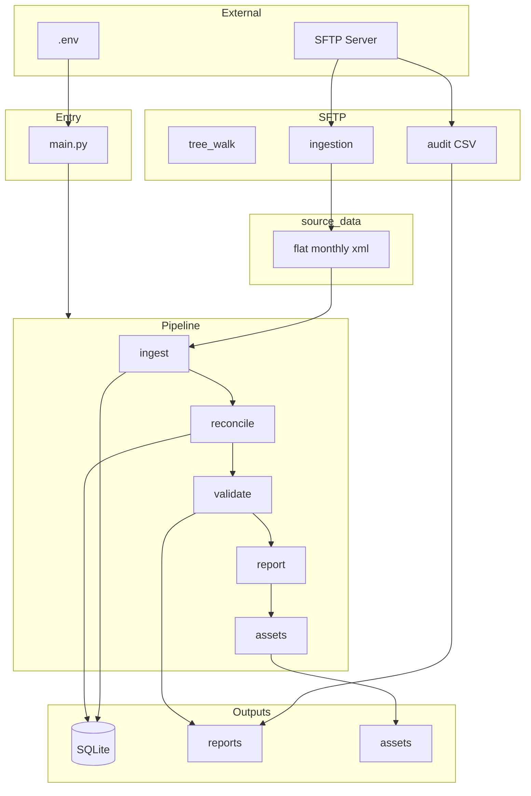
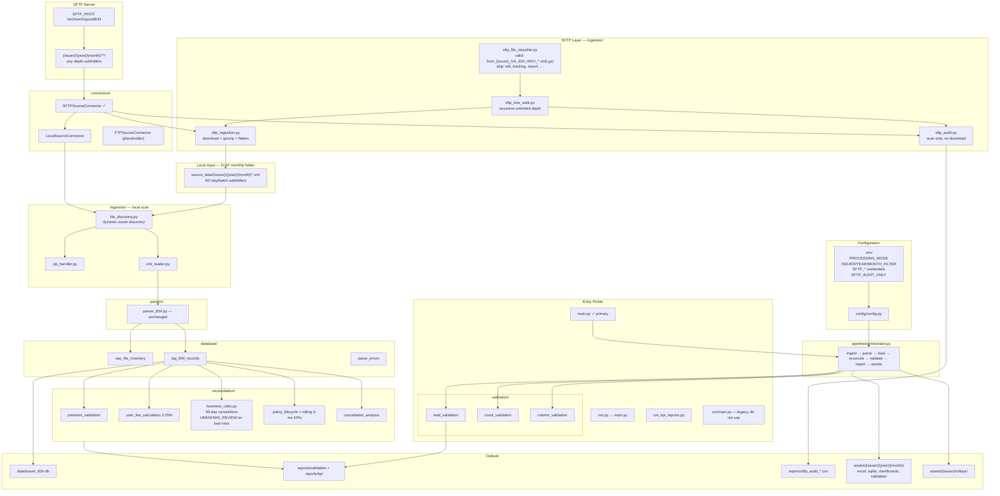
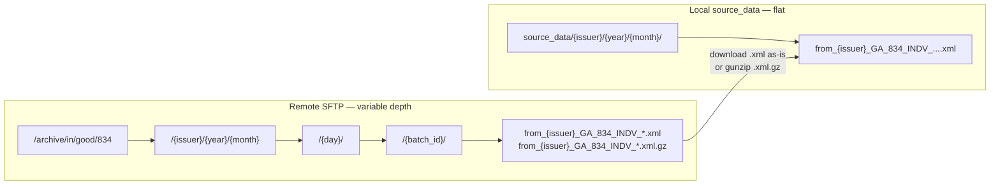
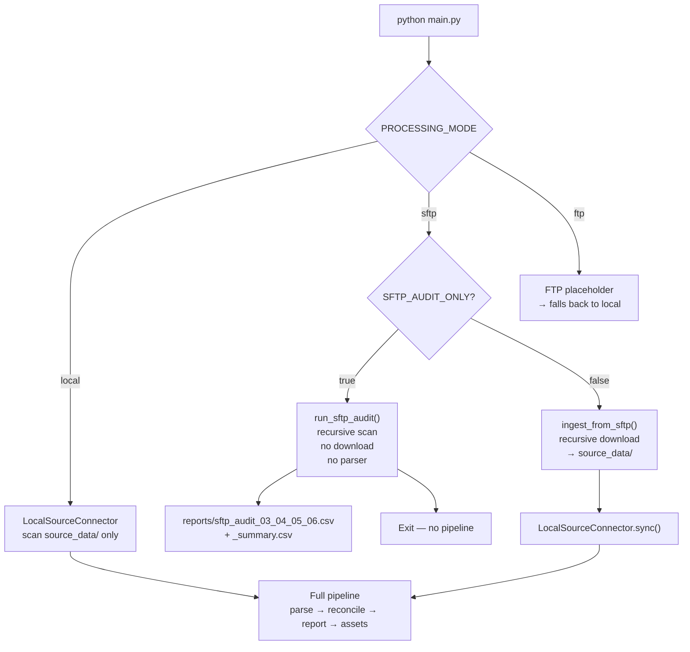
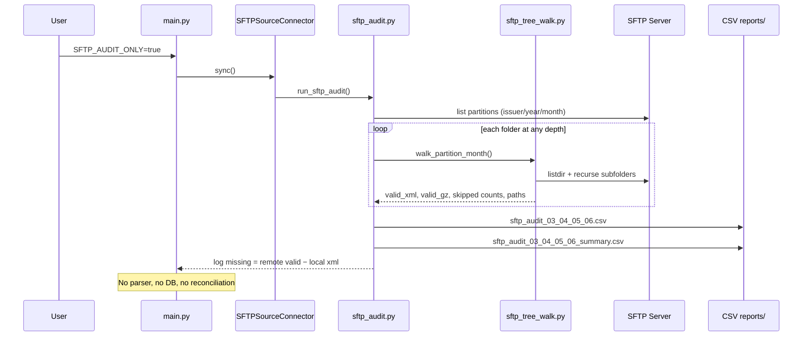
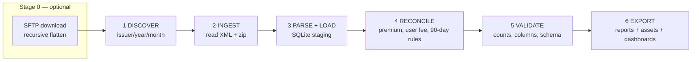
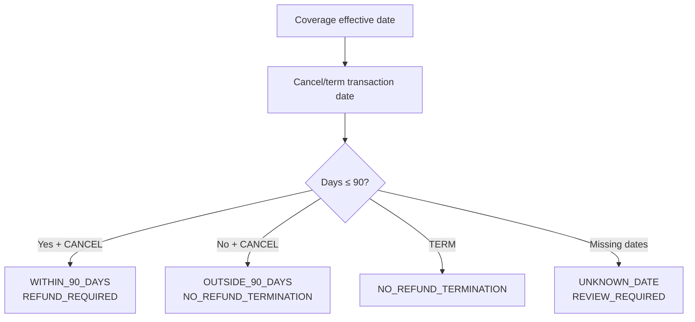
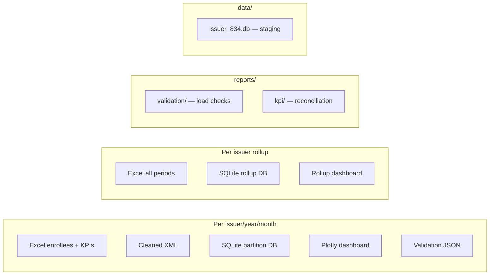

# 834 Issuer ETL Framework
## Architecture Diagram & KPI / Validation Reference

> **View diagrams (recommended):** Open **`docs/project_diagram.html`** in Chrome, Edge, or Firefox (double-click the file).
> Markdown preview in VS Code/Cursor often does **not** render Mermaid unless you install a Mermaid extension.

---

# MASTER — Whole Project Diagram

**Easiest:** open [project_diagram.html](project_diagram.html) in your browser.

Simplified Mermaid (compatible syntax):



## Project directory map

```
834_issuer_etl/
├── main.py                    ← RUN THIS (full pipeline)
├── run.py                     ← alias for main.py
├── run_validation.py          ← validation only
├── run_kpi_reports.py         ← KPI reports only
├── .env / .env.example        ← credentials + mode + filters
├── requirements.txt           ← pandas, lxml, paramiko, plotly, …
│
├── config/config.py           ← settings from .env
├── connectors/                ← local | sftp | ftp
├── ingestion/                 ← file_discovery, SFTP walk/audit/download
├── parsers/parser_834.py      ← 834 XML → records
├── database/                  ← schema, db, loaders
├── validation/                ← count, column, load checks
├── reconciliation/            ← premiums, fees, 90-day rules, KPIs
├── reporting/                 ← Excel/CSV report writers
├── pipeline/
│   ├── orchestrator.py        ← full pipeline coordinator
│   └── assets_exporter.py     ← bridges DB → assets/
│
├── source_data/               ← INPUT (flat monthly XML)
├── data/issuer_834.db         ← staging SQLite
├── reports/                   ← validation + kpi + sftp_audit CSVs
├── assets/                    ← per-partition + rollup exports
├── extracted/ logs/           ← working dirs
│
├── docs/ARCHITECTURE_AND_SLIDES.md
└── src/                       ← LEGACY (do not use for production runs)
```

## Data flow summary

| Step | From | To | Module |
|------|------|-----|--------|
| 0 | SFTP remote `**` | `source_data/{i}/{y}/{m}/` | `sftp_ingestion` + `sftp_tree_walk` |
| 0a | SFTP remote audit | `reports/sftp_audit_*.csv` | `sftp_audit` |
| 1 | `source_data/` | file list | `file_discovery` |
| 2 | `.xml` bytes | staging rows | `parser_834` + `loaders` |
| 3 | `stg_834_records` | fee/premium/rule columns | `reconciliation/*` |
| 4 | staging DB | validation reports | `validation/*` |
| 5 | staging DB | KPI Excel | `report_runner` |
| 6 | staging DB | assets + dashboards | `assets_exporter` + `src/` exporters |

---

# SLIDE 1 — Project Overview

**834 Issuer ETL Framework**

Daily 834 XML enrollment pipeline for health insurance issuers.

| Capability | Description |
|------------|-------------|
| **Ingest** | Local files, **SFTP** (recursive unlimited depth), FTP placeholder |
| **Parse** | 834 XML → SQLite staging (full payload preserved) |
| **Validate** | Source-to-target counts, schema, data quality |
| **Reconcile** | Policy lifecycle, cancellations, premiums, user fees |
| **Report** | Excel/CSV KPIs + interactive Plotly dashboards |

**Granularity:** Issuer → Year → Month (partitioned)

---

# SLIDE 2 — Full System Architecture (Current)



---

# SLIDE 2A — SFTP Remote vs Local (Flattening)

Remote structure is **deeper**; local structure is **always flat** per month.



**Example (issuer 82824, April 2026):**

```
REMOTE (depth 3):
/archive/in/good/834/82824/2026/04/10/3709055_13201095595/from_82824_GA_834_INDV_20260410153000.xml

LOCAL (flat):
source_data/82824/2026/04/from_82824_GA_834_INDV_20260410153000.xml
```

| Rule | Detail |
|------|--------|
| Walk start | `SFTP_ROOT/{issuer}/{year}/{month}` |
| Depth | Unlimited — recurse every subfolder |
| Month folders | `3` or `03`, `10` or `010` both OK |
| Day folders | `1` or `01` both OK |
| Valid files | `from_{issuer}_GA_834_INDV_*.xml` **and** `*.xml.gz` |
| Skip | `.edi`, `.edi.gz`, `.edi.bad`, `.edi.good`, tracking, report, summary, log, `to_*` |
| Local layout | Never create day/batch folders |

---

# SLIDE 2B — Processing Modes



| Mode | `.env` | Behavior |
|------|--------|----------|
| **Local** | `PROCESSING_MODE=local` | Read existing `source_data/` only |
| **SFTP download** | `PROCESSING_MODE=sftp`<br>`SFTP_AUDIT_ONLY=false` | SFTP → flatten → full pipeline |
| **SFTP audit** | `PROCESSING_MODE=sftp`<br>`SFTP_AUDIT_ONLY=true` | Scan remote, CSV report, no download |
| **FTP** | `PROCESSING_MODE=ftp` | Not implemented — uses local |

**Filters (all modes):** `ISSUER_FILTER`, `YEAR_FILTER`, `MONTH_FILTER` (single issuer/month; CLI `--issuer --year --month` overrides)

**Audit month allowlist:** `SFTP_AUDIT_MONTHS=03,04,05,06` (audit mode only; download uses `MONTH_FILTER`)

---

# SLIDE 2C — SFTP Audit Flow



**Summary log per issuer/month:**
- `folders_scanned_count`, `max_depth_scanned`
- `total_valid_xml`, `total_valid_xml_gz`
- `local_xml_files`, `missing_difference`
- `sample_valid_paths` (first 10 remote paths)

---

# SLIDE 3 — Pipeline Flow (6 Stages)



| Stage | Script | What happens |
|-------|--------|--------------|
| Full pipeline | `python main.py` | SFTP (optional) + all 6 stages |
| SFTP audit only | `python main.py` + `SFTP_AUDIT_ONLY=true` | Stage 0 audit only — no stages 1–6 |
| Validation only | `python run_validation.py` | Stage 5 load validation |
| KPI only | `python run_kpi_reports.py` | Stages 4 + 6 KPI reports |

**Clean start:** Each run wipes `data/`, `reports/`, `extracted/`, `assets/` first — **never** `source_data/` (configurable via `CLEAN_ON_START`).

**Do not use:** `src/main.py` (legacy monolith).

---

# SLIDE 4 — Input Folder Structure

```
source_data/                          ← FLAT monthly layout (required)
  {5-digit-issuer}/                   e.g. 86637, 82824, 45334
    {4-digit-year}/                   e.g. 2025, 2026
      {month}/                        e.g. 01, 10  (normalized to 2 digits)
        from_{issuer}_GA_834_INDV_*.xml    ← SFTP lands here (flat)
        archive.zip                   ← optional; extracted, zip kept
        nested/subfolder/*.xml        ← local scan supports nested (legacy)
```

**SFTP writes flat** — no `day/` or `batch/` folders locally.

| Rule | Detail |
|------|--------|
| Issuer folder | Exactly **5 digits** |
| Year folder | Exactly **4 digits** |
| Month folder | **01–12** (normalized to 2 digits; `10` → `10`) |
| No hardcoded issuers | Auto-discovered from folder names |
| Filters | `.env` or CLI `--issuer`, `--year`, `--month` |
| SFTP remote | Any depth under `{issuer}/{year}/{month}/` |

---

# SLIDE 5 — Database Tables

## `raw_file_inventory` (one row per XML file)

| Column | Purpose |
|--------|---------|
| `file_id` | Primary key |
| `issuer`, `year`, `month` | Partition keys |
| `file_name`, `file_path` | Source traceability |
| `file_hash` | SHA-256 duplicate detection |
| `file_size`, `file_type` | File metadata |
| `source_type` | `local` / `ftp` / `sftp` |
| `processed_status` | `pending` / `success` / `failed` |
| `error_message` | Parse/load errors |
| `created_at` | Processing timestamp |

## `stg_834_records` (one row per enrollee)

See Slide 6 for full column list.

## `parse_errors` (failed files)

`issuer`, `year`, `month`, `file_name`, `file_path`, `error_message`, `created_at`

---

# SLIDE 6 — Staging Columns (`stg_834_records`)

## Identity & Member

| Column | XML Source | Required |
|--------|------------|----------|
| `issuer` | Folder name | ✓ |
| `year`, `month` | Folder path | ✓ |
| `policy_id` | `exchgAssignedPolicyID` | ✓ |
| `member_id` | `exchgIndivIdentifier` | ✓ |
| `subscriber_id` | `exchgSubscriberIdentifier` | ✓ |
| `member_first_name` | `memberFirstName` | |
| `member_last_name` | `memberLastName` | |
| `relationship` | `relationshipLkp` | |
| `subscriber_flag` | `subscriberFlag` | |

## Action & Coverage

| Column | XML Source |
|--------|------------|
| `action_code` | `eventTypeLkp` |
| `action_code_description` | CONFIRM / CANCEL / TERM mapped |
| `maintenance_type_code` | `maintenanceTypeCode` |
| `additional_maint_reason_code` | `additionalMaintReason` |
| `coverage_status` | Derived from action |
| `benefit_effective_date` | `benefitEffectiveBeginDate` |
| `benefit_end_date` | `benefitEffectiveEndDate` |
| `member_maint_effective_date` | `memberMaintEffectiveDate` |
| `insurance_type_code` | `insuranceTypeLkp` |
| `health_coverage_policy_no` | `healthCoveragePolicyNo` |
| `household_or_employee_case_id` | `householdOrEmployeeCaseID` |
| `rating_area` | `ratingArea` |
| `source_exchg_id` | `sourceExchgID` |

## Premium & User Fee

| Column | Formula / Source |
|--------|------------------|
| `total_premium_amount` | `totalPremiumAmt` |
| `individual_responsibility_amount` | `totalIndivResponsibilityAmt` |
| `aptc_amount` | `aptcAmt` |
| `user_fee_amount` | `total_premium × 0.0325` |
| `expected_user_fee` | Same rate (3.25%) |
| `premium_validation_status` | PASS / MISMATCH / MISSING_PREMIUM |

## 90-Day Cancellation (computed)

| Column | Values |
|--------|--------|
| `days_between_effective_and_cancel` | Integer days |
| `months_between_effective_and_cancel` | Decimal months |
| `cancellation_window_status` | WITHIN_90_DAYS / OUTSIDE_90_DAYS / UNKNOWN_DATE |
| `refund_eligibility` | REFUND_REQUIRED / NO_REFUND_TERMINATION / REVIEW_REQUIRED |

## Audit

| Column | Purpose |
|--------|---------|
| `raw_xml_path` | Original file path |
| `raw_payload` | Full parsed record as JSON (no data loss) |
| `created_at` | Load timestamp |

---

# SLIDE 7 — Load Validation (Before KPIs)

**Script:** `run_validation.py` | **Output:** `reports/validation/`

| Check | What it proves |
|-------|----------------|
| **Row count by issuer** | Total records per issuer |
| **Row count by issuer/year/month** | Monthly partition counts |
| **Row count by action_code_description** | CONFIRM vs CANCEL vs TERM breakdown |
| **Reference count match** | Compare to `REFERENCE_ROW_COUNTS` in `.env` |
| **Column availability** | % populated per required/optional field |
| **Duplicate file detection** | Same `file_hash` registered twice |
| **Parse error report** | Files that failed XML parsing |
| **Missing required fields** | Rows with null `policy_id`, `member_id`, etc. |

### Required fields validated

`issuer`, `policy_id`, `member_id`, `subscriber_id`, `benefit_effective_date`, `total_premium_amount`

### Output files

| File | Content |
|------|---------|
| `{issuer}_load_validation.xlsx` | All count validations |
| `row_count_by_month_action.csv` | Monthly action breakdown |
| `parse_errors.csv` | Failed files |
| `missing_required_fields.csv` | Incomplete rows |

---

# SLIDE 8 — Schema & Data Quality Validation (Assets Export)

**Applied per partition** when generating `assets/` outputs.

## Schema Validation (15+ checks)

| Check | Rule |
|-------|------|
| `required_columns_exist` | All expected columns present |
| Required ID fields | `issuer_id`, `exchg_indiv_identifier`, `exchg_assigned_policy_id` not null |

## Data Quality Validation

| Check | Rule |
|-------|------|
| `required_id_*` | No null/empty ID fields |
| `duplicate_within_file` | No duplicate issuer+file+member in same file |
| `duplicate_across_files` | Cross-file duplicate detection |
| `qtyt_consistency` | QTYt matches enrollee count per enrollment |
| `subscriber_flag_valid` | Must be `Y` or `N` |
| `insurance_type_codes_tracked` | Distinct insurance types found |
| `*_numeric` | Premium fields are numeric |
| `total_premium_amt_non_negative` | No negative premiums |
| `benefit_effective_begin_date_not_null` | Coverage dates present |
| `source_exchg_id_present` | Exchange ID when available |
| `high_missingness_columns` | WARN if >50% missing |
| `row_counts_by_file` | Profile rows per source file |

**Status:** PASS / WARN / FAIL per check

---

# SLIDE 9 — Monthly KPIs (Per Issuer / Year / Month)

**Granularity:** Monthly partition + issuer rollup  
**Output:** `reports/kpi/issuer_kpi_summary.xlsx` + `assets/{issuer}/{year}/{month}/`

## Policy Lifecycle KPIs

| KPI | Definition |
|-----|------------|
| `confirmed_policies` | `action_code_description` = Confirm OR `additional_maint_reason_code` = CONFIRM |
| `cancelled_policies` | Cancel action/reason |
| `terminated_policies` | Term action/reason |
| `cancellations_within_90_days` | Cancel within 90-day window |
| `cancellations_outside_90_days` | Cancel after 90 days |
| `refund_eligible_count` | `refund_eligibility` = REFUND_REQUIRED |
| `refund_eligible_user_fee` | Sum of expected user fee for refund cases |
| `distinct_policies` | Unique `policy_id` |
| `distinct_members` | Unique `member_id` |
| `total_records` | Row count |

## Asset Dashboard KPIs (per partition)

| Metric | Description |
|--------|-------------|
| `total_files_processed` | Unique XML files |
| `total_enrollees` | Enrollee row count |
| `total_subscribers` | `subscriber_flag` = Y |
| `total_dependents` | `subscriber_flag` = N |
| `unique_policies` | Distinct policies |
| `unique_members` | Distinct members |
| `unique_households` | Distinct household IDs |
| `duplicate_member_count` | Duplicate member IDs |
| `total_premium_amount` | Sum of premiums |
| `average_premium_amount` | Mean premium |
| `total_individual_responsibility_amount` | Sum of member responsibility |

## Dimensional Breakdowns (Excel + Dashboard charts)

| Breakdown | Column |
|-----------|--------|
| By subscriber flag | `subscriber_flag` |
| By relationship | `relationship_code` |
| By event type | `event_type_code` |
| By event reason | `event_reason_code` |
| By maintenance type | `maintenance_type_code` |
| By insurance type | `insurance_type_code` |
| By rating area | `rating_area` |
| By effective month | `benefit_effective_begin_date` |
| Premium by rating area | `rating_area` × `total_premium_amt` |
| Enrollees by source file | `source_file` |
| By source period (rollup) | `source_period` |

---

# SLIDE 10 — Rolling 3-Month KPIs

**Granularity:** Rolling windows per issuer  
**Output:** `reports/kpi/rolling_3_month_kpi_summary.xlsx`

| Window Example | Months Included |
|----------------|-----------------|
| Jan–Mar | 2026-01, 2026-02, 2026-03 |
| Feb–Apr | 2026-02, 2026-03, 2026-04 |
| Mar–May | 2026-03, 2026-04, 2026-05 |
| … | Continues through year |

**All monthly KPIs summed** across the 3-month window:
confirmed, cancelled, terminated, 90-day cancellations, refund eligible user fee, distinct policies/members, total records.

---

# SLIDE 11 — Premium & User Fee Validation

## Premium Arithmetic

```
individual_responsibility_amount + aptc_amount = total_premium_amount
(tolerance: ±$0.02)
```

| Status | Meaning |
|--------|---------|
| `PASS` | Formula balances |
| `MISMATCH` | Formula does not balance |
| `MISSING_PREMIUM` | `total_premium_amount` is null |

**Report:** `reports/kpi/premium_mismatch_report.xlsx`

## User Fee (3.25%)

```
expected_user_fee = total_premium_amount × 0.0325
```

| Report | Content |
|--------|---------|
| `user_fee_validation.xlsx` | User fee revenue by issuer/year/month |
| `refund_eligibility_report.xlsx` | Refund-required user fees |

| Metric | Description |
|--------|-------------|
| `total_user_fee` | Sum of expected user fees per month |
| `total_premium` | Sum of premiums per month |
| Refund cases | User fees where `refund_eligibility` = REFUND_REQUIRED |

---

# SLIDE 12 — 90-Day Cancellation Business Rules



| Rule | Business meaning |
|------|------------------|
| Cancel within 90 days | User fee may require **refund** |
| Cancel after 90 days | Treated as **termination** — no refund |
| Termination | No refund for valid covered months |
| Missing dates | Flagged for **manual review** |

**Report:** `reports/kpi/cancellation_window_summary.xlsx`

---

# SLIDE 13 — Reconciliation Reports

| Report | What it finds | Output file |
|--------|---------------|-------------|
| **Cancellation gap** | Active in one month, cancelled in later month | `cancellation_gap_report.xlsx` |
| **Repeated cancel** | Same policy/member cancelled multiple times | `repeated_cancel_report.xlsx` |
| **Cancel without confirm** | Cancel with no prior CONFIRM record | `{issuer}_cancel_without_confirm.xlsx` |
| **Premium mismatch** | APTC + responsibility ≠ premium | `premium_mismatch_report.xlsx` |
| **Household counts** | Policies with >1 subscriber or member | `{issuer}_household_counts.xlsx` |
| **Refund eligibility** | Records requiring user fee refund | `refund_eligibility_report.xlsx` |

---

# SLIDE 14 — Asset Outputs (Per Partition)

```
assets/{issuer}/{year}/{month}/
  excel/
    cleaned_enrollees_{issuer}_{year}_{month}.xlsx
    kpi_summary_{issuer}_{year}_{month}.xlsx
    validation_report_{issuer}_{year}_{month}.xlsx
  cleaned_xml/
    cleaned_enrollees_{issuer}_{year}_{month}.xml
  sqlite/
    issuer_{issuer}_{year}_{month}.db
  dashboards/
    issuer_{issuer}_{year}_{month}_dashboard.html   ← Plotly interactive
  validation_reports/
    validation_report_{issuer}_{year}_{month}.json

assets/{issuer}/rollups/
  excel/   sqlite/   dashboards/   (all periods combined)
```

### Dashboard charts (HTML)

1. KPI Summary table  
2. Enrollees by source file  
3. Subscribers vs dependents (pie)  
4. Premium by rating area  
5. Members by effective month  
6. Validation issue summary  
7. Missingness by column (top 15)  
8. Duplicate count indicator  

---

# SLIDE 15 — Output Summary Map



---

# SLIDE 16 — How to Run

```bash
cd 834_issuer_etl
cp .env.example .env
pip install -r requirements.txt

# Full pipeline — all issuers in source_data/
python main.py

# Single issuer
python main.py --issuer 86637

# Single partition
python main.py --issuer 86637 --year 2026 --month 02

# Validation only
python run_validation.py --issuer 86637

# KPI reports only
python run_kpi_reports.py --issuer 86637
```

### `.env` key settings

| Variable | Default | Purpose |
|----------|---------|---------|
| `CLEAN_ON_START` | `true` | Wipe outputs before each run |
| `USER_FEE_RATE` | `0.0325` | 3.25% user fee |
| `CANCELLATION_WINDOW_DAYS` | `90` | Retroactive cancel window |
| `REFERENCE_ROW_COUNTS` | empty | e.g. `86637=16464` for validation |

---

# SLIDE 17 — KPI Frequency Summary

| KPI Category | Frequency | Where |
|--------------|-----------|-------|
| File inventory counts | **Per file** | `raw_file_inventory` |
| Staging row counts | **Per issuer/year/month** | `stg_834_records`, validation reports |
| Policy lifecycle (confirm/cancel/term) | **Monthly** | `issuer_kpi_summary.xlsx` |
| Premium validation | **Per record** | `premium_validation_status` column |
| User fee revenue | **Monthly** | `user_fee_validation.xlsx` |
| 90-day cancellation window | **Per record** | `cancellation_window_status` |
| Rolling 3-month totals | **Quarterly windows** | `rolling_3_month_kpi_summary.xlsx` |
| Dashboard breakdowns | **Per partition + rollup** | `assets/.../dashboards/*.html` |
| Schema / DQ checks | **Per partition** | `validation_report_*.xlsx` |
| Duplicate detection | **Per file + cross-file** | Validation + staging |

---

*834 Issuer ETL Framework — Architecture & KPI Reference*
